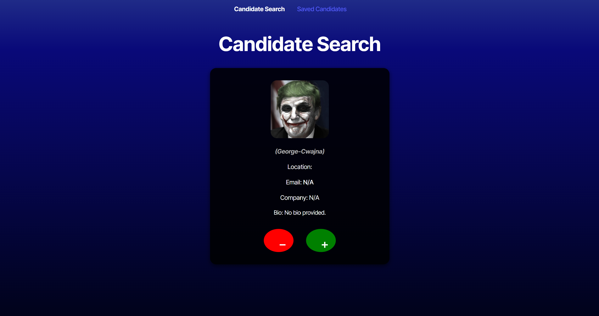
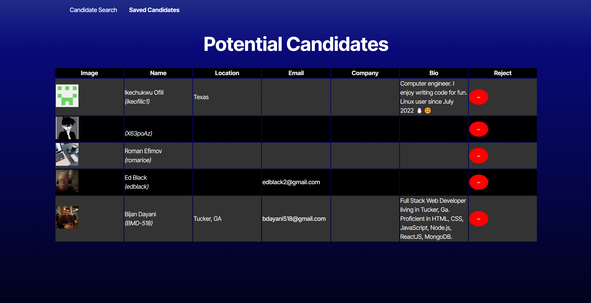

#  React Recruiter

Welcome to React Recruiter! This application allows employers to browse potential candidates by pulling real GitHub user data. Built with modern tools like React, Vite, and TypeScript, it features a clean interface, responsive design, and localStorage-based shortlist management.

---

## Live Site

**[View Deployed Application on Render](https://react-recruiter.onrender.com/)**

---

##  Screenshots

### Candidate Search  

### Saved Candidates  

---

##  Technologies Used

- React
- TypeScript
- Vite
- React Router DOM
- GitHub REST API
- Render (Deployment)

---

##  Project Structure

- Candidate Search page to view and interact with one user at a time
- Saved Candidates page with styled table layout and remove functionality
- Responsive layout and dark theme styling via custom CSS
- GitHub API integration with personal access token (via `.env`)
- Routes handled with React Router (`/` and `/saved`)
- Data persistence using `localStorage`
- Interface typing with `GitHubUser` in TypeScript

---

##  Developer

**Chris Munoz**

- **Email:** chrismunozpro@email.com  
- **GitHub:** [FadedSetton](https://github.com/FadedSetton)

---

##  License

MIT
